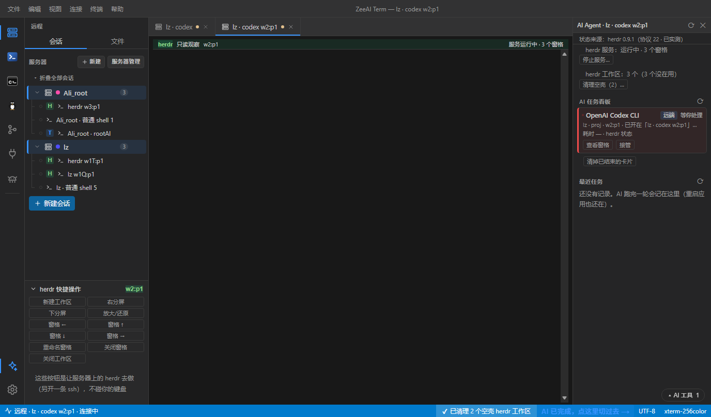
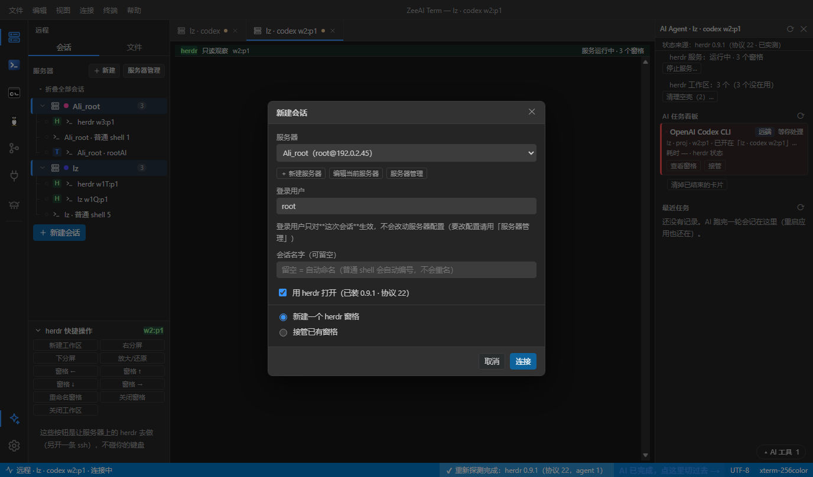

<div align="center">

# ZeeAI Term

**Windows 上的多协议终端工作台**
一台机器管住 SSH / tmux / herdr、串口、ADB、本地终端，还有一块 AI 任务看板。

[](#下载)
[](https://github.com/zeelinkCN/ZeeAI_Term/releases/latest)
[](#技术栈)
[](#许可证)



</div>

---

## 它是什么

给同时要摸好几台机器的人用的终端工具：**远端**连着服务器（SSH + tmux/herdr 持久会话、SFTP 文件、AI 在跑什么一目了然），**本地**开着 PowerShell / CMD / WSL，**手边**还挂着串口和 ADB 设备。

和普通终端不一样的地方：会话是**留在服务器上**的（关掉窗口明天回来还在）；AI 任务的产物能在应用里直接预览、下载；关键字高亮只影响界面，**落盘的日志永远是纯文本**。

<div align="center">

</div>

## 功能一览

| | |
|---|---|
| **远端连接** | SSH（密钥 / 密码，复用系统 OpenSSH）、跳板机、断线指数退避重连 |
| **持久会话** | tmux 与 **herdr** 两种多路复用器，可接管可只读观察；关掉标签，会话仍留在服务器上 |
| **herdr 专治"忘了关"** | 侧栏 `H` 标 + 终端上方状态条；服务器右键可管理工作区（接管 / 观察 / 回收）；只清理"空壳" |
| **远端文件** | 真 SFTP：浏览 / 上传（多选、目录递归）/ 下载（断点续传）/ 重命名 / 删除；MD、HTML、图片、代码直接预览 |
| **本地终端** | PowerShell 5.1 / PowerShell 7 / CMD / WSL，可单开管理员窗口或整个应用提权 |
| **设备侧** | 串口（每条连接独立参数）、ADB logcat + 文件管理 + Fastboot 设备探测（看设备与版本，**不刷机**；内置 platform-tools，免装） |
| **Git** | 打开本地仓库、暂存 / 提交 / 历史与 diff / 分支切换；每个工作空间可单独开终端 |
| **AI 面板** | 探测服务器上装了哪些 AI 命令行工具，一键安装 / 启动；看板汇总多环境任务状态（运行中 / 等你处理 / 耗时 / Token）与产物清单 |
| **看板与标签对得上** | 卡片写明它对着哪个终端标签，已经开着时按钮变「切到标签」 |
| **观感** | 14 套界面主题 + 15 套终端配色（可粘贴 Windows Terminal 配色 JSON）、四种分屏、侧栏可拖宽、`Ctrl+滚轮` 随手缩放字号 |
| **留档** | 终端日志（剥掉颜色转义，记事本可读）、关键字高亮（仅界面生效）、回滚行数可调 |

## 下载

到 [**Releases**](https://github.com/zeelinkCN/ZeeAI_Term/releases/latest) 取最新版，四个产物任选一个：

| 产物（当前 **0.1.10**） | 适合谁 | 体积 |
|---|---|---|
| `ZeeAI_Term_0.1.10_x64-setup.exe` | 大多数人：双击安装，带开始菜单与卸载 | ~6 MB |
| `ZeeAI_Term_0.1.10_x64_en-US.msi` | 需要走组策略 / 批量部署 | ~9 MB |
| `ZeeAI_Term-0.1.10-portable.zip` | 不想安装：解压即用，**内含 platform-tools** | ~9 MB |
| `ZeeAI_Term.exe` | 已经有安装目录，只想换主程序 | ~8 MB |

> 便携版：解压后 `resources/` 目录**必须和 exe 放在一起**（ADB 在里面）。
> 便携版**没有**应用内一键升级（没有安装目录可写）：换新版就下载新 zip、解压覆盖，
> 覆盖前先关掉正在跑的窗口即可。安装版 / MSI 版可以在应用内「设置 → 检查更新」一键升级；
> 下载一律做大小 + 文件头 + 官方 sha256 三重校验。

**系统要求**：Windows 10 / 11（x64）。需要 WebView2 运行时 —— Win11 自带，安装包会处理。

## 开发

```powershell
npm install
npm run tauri dev      # 开发模式（热更新）
npm run tauri build    # 出 exe + NSIS + MSI
```

> **打包必须走 `npm run tauri build`。** 只跑 `cargo build --release` 不会把前端资源嵌进二进制，
> 得到的 exe 一打开就是「localhost 拒绝连接」。

测试（都不弹窗口）：

```powershell
cd src-tauri ; cargo test --lib      # 后端单测（解析、消毒、状态机）
npm run fe:smoke                     # 界面功能测试：无头 Edge 真点按钮 + 出截图
```

**技术栈**：Tauri 2（Rust + WebView2）· React + TypeScript + xterm.js · `portable-pty` / `russh` / `serialport` / `tokio`

## 文档

- [技术设计与里程碑](docs/design.md) · [决策与待确认事项](docs/decisions.md)
- [发版说明](docs/release-notes-v0.1.10.md) —— 每版都写清改了什么、为什么、已知限制
- 实现日志：[herdr](docs/impl-log-2026-09-29-herdr.md) · [herdr 会话](docs/impl-log-2026-09-29-herdr-session.md) · [其它](docs/impl-log-2026-09-27.md)

## 许可证

**GNU General Public License v3.0 或更新版本**（`GPL-3.0-or-later`），全文见 [LICENSE](LICENSE)。

```
ZeeAI_Term · Windows 多协议终端工作台
Copyright (C) 2026 zeelinkCN

本程序是自由软件：你可以按自由软件基金会发布的 GNU 通用公共许可证
（第 3 版或你选择的任何更新版本）的条款重新分发和/或修改它。

本程序的分发是希望它有用，但不提供任何担保，甚至不包含适销性或
特定用途适用性的默示担保。详见 GNU 通用公共许可证。
```

这意味着：可以自由使用、修改、分发，但**分发修改版时必须一起提供源代码**，
且不能附加额外限制。想要闭源再分发的场景请先联系作者。

随包分发、但不属于本项目的第三方组件各自跟随其原始许可：ADB platform-tools（Android SDK 条款）、
herdr（其官方许可），以及 Rust / npm 依赖树里的各个 crate 与包。
