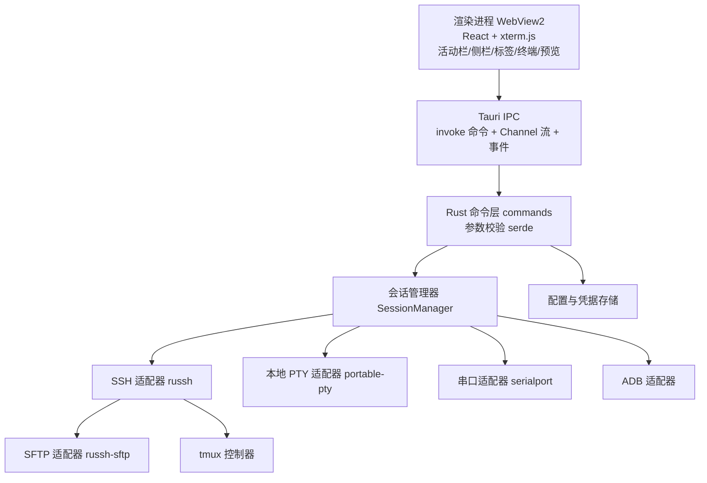
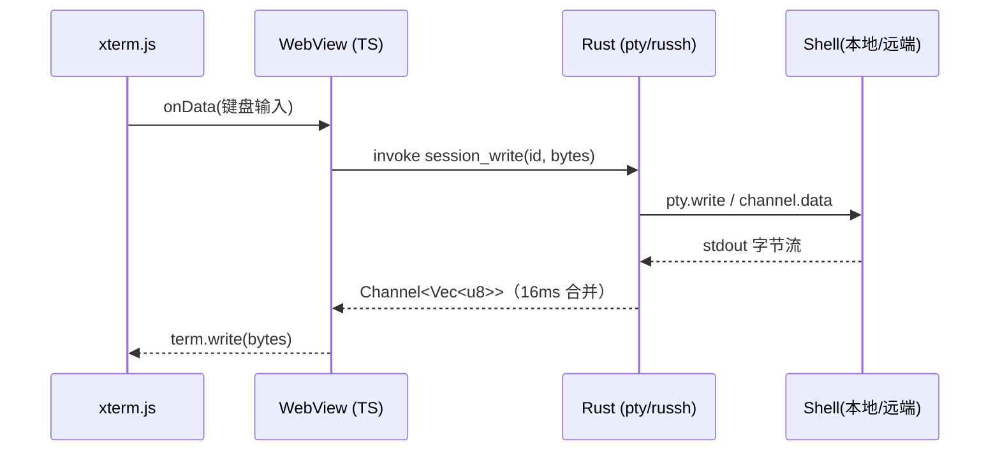

# ZeeAI Terminal 技术设计文档

版本 v0.3 · 2026-09-24 · 状态：主选型与关键决策已确认，可进入 M0

---

## 0. 摘要（TL;DR）

- **主选型：Tauri 2 + Rust（后端）+ TypeScript / xterm.js（前端）。**
- **关键库**：`portable-pty`（PTY/ConPTY）、`russh` + `russh-sftp`（SSH/SFTP，`ssh2` 作兼容兜底）、`serialport`（串口）、平台 `adb`（子进程）、`tokio`（异步）。
- **前置工具链**：Rust（rustup，MSVC 工具链需 VS Build Tools 的 C++ 生成工具）、Node.js LTS、WebView2（Win11 已自带）。
- **为什么选 Rust**：体积约 10–40MB、内存约 100–150MB，且会话越多优势越明显；SSH/SFTP/串口都是二进制协议解析，Rust 的安全性与类型系统能显著减少底层 bug；为将来做原生终端渲染/多路复用留了路。
- **需要接受的代价**：双语言（Rust + TS）、开发时间约为 Electron 方案的 1.5 倍。
- **首版拆成 6 个里程碑**：M0 技术验证，**M1 直接做 SSH + tmux**（已提前），M2 本地终端与文件窗格，M3 SFTP/预览，M4 串口/ADB，M5 打磨发布。
- **已确认**：仅 Windows；独立仓库；内置 tmux 会话管理面板；内置 platform-tools；口令存 Windows 凭据管理器；退出保存/启动恢复工作区。

---

## 1. 文档目的与范围

本文档用于评审 **Windows 端多协议终端工作台（ZeeAI Terminal）** 的技术实现方案，覆盖：

- 技术选型（语言 / 框架 / 关键依赖）与依据
- 总体架构、进程模型与启动流程
- 核心领域模型（连接 / 会话 / 工作区 / 标签）
- 关键技术细节（终端、SSH+tmux、SFTP+预览、串口、ADB、本地终端、凭据与安全）
- IPC 契约、目录结构、里程碑、风险

**平台范围：仅 Windows**（不做 macOS/Linux 兼容，因此可放心使用 Windows 专有能力：ConPTY、凭据管理器、MSI/NSIS 打包）。

不在本版范围：具体视觉细节（已在交互稿中确认）、云端同步、插件市场、移动端。

**已确认的产品形态（来自交互稿）**

- VS Code 风格外壳：标题栏（菜单）/ 活动栏 / 侧栏 / 主区 / 状态栏。
- 左侧活动栏分组：**远程**（SSH）在最上方；分隔线下方是**本地工具组**：PowerShell、CMD、WSL、Git、串口、ADB；最底部是设置。
- 「远程」模块内：侧栏有「会话 / 文件」两个子窗格（连接树 / 远程文件浏览）。
- 主区：**每个会话 = 一个工作区**；工作区顶部是该会话的标签，**终端为主标签（高亮）**，打开的文件是**会话下的二级副标签**，各会话互不干扰。
- 文件预览：MD / HTML 默认渲染预览，可切换源码；Markdown 支持多套预览样式。

---

## 2. 技术选型

### 2.1 候选方案对比

| 维度 | **Tauri 2 + Rust（选定）** | Electron + TypeScript | .NET 8 + WebView2 |
|---|---|---|---|
| 本地 PTY（Win11 ConPTY） | `portable-pty`，成熟 | node-pty，成熟 | 需 P/Invoke ConPTY，工作量最大 |
| 终端渲染 | xterm.js（WebView2） | xterm.js（Chromium） | xterm.js（WebView2） |
| SSH / SFTP | `russh` / `russh-sftp`（兜底 `ssh2`） | ssh2，成熟 | SSH.NET，成熟 |
| 串口 | `serialport` crate | serialport | System.IO.Ports（内置） |
| 语言数量 | 2（Rust + TS） | 1（TS） | 2（C# + 前端） |
| 安装包体积 | 约 10–40 MB | 约 150 MB | 约 60–100 MB |
| 运行内存 | 约 100–150 MB | 300–500 MB | 约 150–250 MB |
| 开发速度 | 中等（约 1.5x） | 最快 | 中等偏慢（PTY 拖后腿） |
| 同类参考 | Termiaxial、OxideTerm | Tabby、electerm、Hyper | 较少 |
| 本机前置 | 装 Rust + Node.js | 装 Node.js | 装 .NET 8 SDK |

### 2.2 选型结论与理由

**选定 Tauri 2 + Rust。**

理由：

1. **终端工作台是常驻型、多会话工具**：内存与体积的收益会被放大。空闲约 100–150MB，对比 Electron 的 300–500MB，且同时开十几个 SSH 会话时差距更明显。
2. **协议解析吃重且敏感**：SSH、SFTP、串口都是二进制/状态机协议，Rust 的内存安全与强类型能少掉一大批低级 bug。
3. **async 模型更契合**：`tokio` 管理几十个并发连接比 Node 的事件循环更可控；`portable-pty`、`russh` 都是异步友好的。
4. **前端不用改**：终端仍是 xterm.js，UI 仍是 React + TS，交互稿里的东西可以 1:1 落地；WebView2 在 Win11 已自带（本机 153.x）。
5. **保留未来选项**：若某天要做 GPU 原生终端渲染或内置多路复用，Rust 是唯一可行的延伸方向（WezTerm 即先例）。

**明确的代价**：需要维护 Rust 与 TS 两套代码，Tauri 的 IPC 与状态管理要自己设计，整体开发时间约为 Electron 的 1.5 倍。这个代价已在评审中确认接受。

### 2.3 关键依赖清单（首版）

**Rust 侧（`src-tauri`）**

| 用途 | 依赖 |
|---|---|
| 应用框架 | `tauri` 2.x、`tauri-build` |
| Tauri 插件 | `tauri-plugin-store`（配置）、`tauri-plugin-dialog`、`tauri-plugin-single-instance`、`tauri-plugin-updater` |
| 异步运行时 | `tokio` |
| 本地 PTY | `portable-pty` |
| SSH / SFTP | `russh`、`russh-sftp`（兜底：`ssh2`） |
| 串口 | `serialport` |
| ADB | `tokio::process` 调用平台 `adb` |
| 序列化 / 校验 | `serde`、`serde_json` |
| 凭据 | `keyring`（Windows Credential Manager）；必要时改用 `windows` crate 直接调 DPAPI |
| 日志 | `tracing` + `tracing-subscriber` |

**前端侧**

| 用途 | 依赖 |
|---|---|
| 构建 | vite、typescript |
| UI | react、react-dom（状态可用 zustand） |
| 终端 | `@xterm/xterm` + addon-fit / addon-webgl / addon-search / addon-web-links / addon-unicode11 |
| Markdown | markdown-it（+ task-lists 等插件）、dompurify |
| 校验 | zod（与 Rust 侧 `serde` 对应） |

---

## 3. 总体架构

### 3.1 进程与分层



- **前端（WebView2）**：只负责 UI 与终端渲染，不直接持有连接与密钥。
- **Rust 后端**：所有连接、PTY、文件、凭据都在这里，统一由 `SessionManager` 管理生命周期。
- **适配器层**：SSH / PTY / 串口 / ADB / SFTP 各自独立，向上暴露统一的「会话流」接口（`read` / `write` / `resize` / `close`），方便替换与单测。
- **IPC**：命令用 `invoke`（前端→后端，请求/响应）；终端数据用 Tauri 2 的 `ipc::Channel`（后端→前端，流式）；状态变化用事件广播。

### 3.2 终端数据流与吞吐处理



关键点：

- 终端输出在 Rust 侧做 **约 16ms 合并**后再投递，避免高频 IPC 拖垮前端。
- Channel 直接传二进制（`Vec<u8>`），不走 JSON / base64，减少开销。
- 终端实例启用 **WebGL addon**，并在前端对 `term.write` 做背压（依据 `onWriteParsed` 回调节流）。
- 尺寸变化：前端 `fit` → `invoke session_resize` → `pty.resize()` / `channel.request_pty` 参数更新。

### 3.3 应用启动流程

1. 单实例检查（`tauri-plugin-single-instance`）：已有实例则聚焦并转发参数。
2. 初始化 `tracing` 日志、加载配置存储（`store`）与凭据。
3. 创建主窗口，前端挂载，读取 `connections` / `settings` / 上次的 `workspaces`。
4. 前端按需 `invoke session_open` 恢复上次的会话（可配置是否自动恢复）。
5. 注册全局快捷键（可选：类似 guake 的显示/隐藏）。
6. 退出前 flush 配置与工作区快照。

---

## 4. 核心领域模型

### 4.1 概念

- **ConnectionProfile（连接配置）**：持久化的「怎么连」，不含运行时状态。类型有 `ssh` / `serial` / `adb` / `local`。
- **Session（会话）**：一次运行中的连接实例，对应一个终端。同一 profile 可开多个 Session。
- **Workspace（工作区）**：**与 Session 一一对应**。工作区内：
  - 主标签：`终端`（唯一、常驻、高亮）；
  - 副标签：该会话打开的文件（各会话各自维护）。
- **Group（分组）**：连接树的分组（如「生产环境」）。

### 4.2 数据契约（前端 TS 视角；Rust 侧用 `serde` 镜像）

```ts
type ConnType = 'ssh' | 'serial' | 'adb' | 'local';

interface ConnectionProfile {
  id: string;
  type: ConnType;
  name: string;                 // 显示名，如 prod-web-01
  groupId?: string;
  color?: string;
  ssh?: {
    host: string; port: number; user: string;
    auth: { kind: 'password' | 'key' | 'agent'; keyPath?: string; secretRef?: string };
    jump?: { host: string; port: number; user: string; auth: AuthSpec };
    tmux?: { enabled: boolean; sessionTemplate: string; /* 默认 {host}-{user} */ startDir?: string };
    keepalive?: { intervalMs: number; countMax: number };
  };
  serial?: { path: string; baudRate: number; dataBits: number; stopBits: number; parity: string; flow: 'none' | 'rtscts' | 'xonxoff' };
  adb?: { serial?: string };                     // 空表示弹选择
  local?: { shell: 'powershell' | 'cmd' | 'wsl'; distro?: string; cwd?: string };
}

type SessionState = 'connecting' | 'connected' | 'reconnecting' | 'closed' | 'error';

interface Session {
  id: string;
  profileId: string;
  type: ConnType;
  state: SessionState;
  cols: number; rows: number;
  cwd?: string;                                  // 远端工作目录（ssh）
  tmux?: { enabled: boolean; sessionName?: string };
}

interface WorkspaceState {
  sessionId: string;
  activeTab: 'terminal' | string;                // 'terminal' 或文件名
  openFiles: Array<{ name: string; kind: 'md' | 'html' | 'img' | 'code' | 'text'; path: string }>;
}
```

---

## 5. 关键技术方案

### 5.1 终端与 PTY

- 渲染：`@xterm/xterm` + addon-fit / addon-webgl / addon-search / addon-web-links / addon-unicode11。
- 本地终端（PowerShell / CMD / WSL）：Rust 侧用 `portable-pty` 起进程（Windows 走 ConPTY）。
  - PowerShell：`powershell.exe`（可切换 `pwsh.exe`）
  - CMD：`cmd.exe`
  - WSL：`wsl.exe -d <distro> --cd <dir>`
- 数据经 `ipc::Channel` 与 xterm.js 对接，见 3.2。
- Windows 上 `portable-pty` 的行为要在 M0 先做技术验证（ConPTY 版本、宽字符、resize）。

### 5.2 SSH 与 tmux 持久化

- 库：`russh`（纯 Rust、异步）；若遇到老旧服务器兼容问题，**SSH 适配器接口不变**，可切到 `ssh2` crate（基于 libssh2）。
- 认证：密码 / 私钥（含口令）/ ssh-agent / keyboard-interactive（两步验证）。
- **主机密钥校验**：比对 `known_hosts`；首次连接提示确认（避免中间人）。
- 跳板机：通过已建立连接做 `direct-tcpip` 转发得到新通道，再在其上建立第二段 SSH（等价 ProxyJump）。
- **tmux 集成（核心卖点）**：
  1. 连接后探测：`command -v tmux`；
  2. 若开启持久化：`tmux new-session -A -s <name>`（`-A`：存在则 attach，不存在则新建；可加 `-c <dir>`）；
  3. 会话列表：`tmux list-sessions -F '#{session_name}:#{session_windows}:#{session_attached}'`；
  4. 断线后服务器上 tmux 继续运行；本端**自动重连（指数退避）+ 重新 attach**；
  5. 未装 tmux 时降级为普通 shell 并提示，可选「一键安装」引导。
- Keepalive：定时发送 keepalive 以降低 NAT/空闲断连概率。
- 环境：注入 `TERM=xterm-256color`。
- **tmux 会话管理面板（已确认要做）**：提供面板列出服务器上的 tmux 会话（名称 / 窗口数 / 是否已 attach），并支持新建、attach、kill；与自动 attach 共用同一套会话命名规则。

### 5.3 SFTP 文件管理与工作目录跟随

- 用 `russh-sftp` 做文件操作：列目录、读、写、重命名、删除、新建目录、改权限、上传/下载（带进度）。
- **工作目录跟随（follow terminal）**：
  - 首选 **OSC 7**（`ESC ] 7 ; file://host/path BEL`）——由 shell 集成脚本输出，xterm.js 通过 `parser.registerOscHandler(7, ...)` 捕获，实时、无副作用；
  - 兜底：按需在独立 exec 通道执行 `pwd`（例如打开「文件」窗格时刷新一次）。
- 文件浏览绑定**当前活跃 SSH 会话**：切换会话即切换文件根目录。
- 双击文件 → 拉取到本地临时目录（大文件设上限或用流式读取）→ 交给预览器。
- 上传/下载按钮放在「文件」子窗格自己的工具栏里（属于远程文件场景，不放到全局工具栏）。

### 5.4 MD / HTML 预览

- **默认渲染预览**，工具栏按钮可切到源码；再次点击切回。
- Markdown：`markdown-it` + 插件，渲染前用 `DOMPurify` 消毒；提供多套样式主题（GitHub / 简洁 / 深色 / 文档），与交互稿一致。
- HTML：`DOMPurify` 去除 `<script>` 等危险节点后渲染；在 WebView 内用**沙箱化容器**（设置严格 CSP、禁止外部网络请求）。
- 其它：图片（png/jpg/gif，SVG 需消毒）、代码/文本（等宽 + 高亮）。

### 5.5 串口

- 库：`serialport` crate。
- 设备枚举：列出可用串口（COM 号 + 描述）。
- 打开参数：波特率 / 数据位 / 停止位 / 校验 / 流控（none / rtscts / xonxoff）。
- 与 xterm.js 对接：串口是**原始字节流**，需处理 CR/LF、可选本地回显（local echo），并提供「发送文本 / 发送十六进制」两种输入。
- 归属：**本地工具组**（与 PowerShell/CMD/WSL/Git 并列，位于 Git 之后）。

### 5.6 ADB

- 使用平台工具 `adb`（`tokio::process` 调用）：**随应用内置一份 platform-tools**（已确认），配置可覆盖为自定义路径，不依赖用户机器上的 PATH。
- 功能：设备列表（`adb devices -l`）、`adb -s <serial> shell`（用 `portable-pty` 起交互式 shell）、`logcat`、`push/pull`、截屏（`exec-out screencap -p`）、安装 APK。
- 归属：**本地工具组**（与串口同组），因为连的是本机 USB / 模拟器。

### 5.7 本地终端（PowerShell / CMD / WSL）

- 统一走 `portable-pty`，按 profile 选择可执行文件与参数。
- 与「远程」模块一致地纳入「会话 = 工作区」模型：本地终端也可以有自己的工作区与标签（但没有远程文件窗格，因为不涉及远端目录）。

### 5.8 凭据与安全

- 密码 / 私钥口令：用 `keyring` crate 写入 **Windows 凭据管理器**；若需跨平台再评估 DPAPI / Keychain / Secret Service 的统一封装。
- 私钥：默认存路径 + 口令；可选「复制进来托管」（加密存储）。
- 主机密钥校验：`known_hosts`。
- 预览沙箱：远端 HTML 一律当作**不可信内容**处理（消毒 + CSP + 阻断外链）。
- 默认无遥测。

### 5.9 配置与持久化

- 存储于 Tauri 应用数据目录：
  - `connections.json`：连接配置 + 分组
  - `settings.json`：偏好、快捷键、终端主题
  - `workspaces.json`：**退出时保存、启动时恢复**「打开了哪些会话 / 每个会话打开了哪些文件」（已确认要做，启动恢复可在设置里开关）
  - 凭据：Windows 凭据管理器（不入 JSON）
- 写入策略：防抖落盘，退出前 flush。

---

## 6. IPC 契约（草案）

- 请求/响应用 **Tauri command**（`invoke`），入参用 `serde` 校验。
- 流式数据（终端输出、传输进度）用 **`ipc::Channel`**。
- 状态变化用 **事件**（`emit` / `listen`）。

| 命令 / 事件 | 方向 | 说明 |
|---|---|---|
| `profile_list` / `profile_save` / `profile_delete` | R→B | 连接配置 CRUD |
| `group_list` / `group_save` | R→B | 分组 |
| `session_open(profileId, opts)` | R→B | 打开会话，返回 `sessionId` |
| `session_write(id, bytes)` | R→B | 键盘输入 |
| `session_resize(id, cols, rows)` | R→B | 终端尺寸 |
| `session_close(id)` | R→B | 关闭会话 |
| `session_stream`（Channel） | B→R | 终端字节流 |
| `event: session_state` / `session_cwd` / `session_error` | B→R | 状态推送 |
| `sftp_list` / `sftp_stat` / `sftp_read` / `sftp_write` / `sftp_rename` / `sftp_delete` / `sftp_mkdir` | R→B | 文件操作 |
| `sftp_transfer`（Channel） | B→R | 上传/下载进度 |
| `tmux_list` / `tmux_attach` / `tmux_new` / `tmux_kill` | R→B | tmux 会话管理 |
| `serial_list` / `serial_open` / `serial_send` | R→B | 串口 |
| `adb_devices` / `adb_shell` / `adb_logcat` / `adb_push` / `adb_pull` | R→B | ADB |

（R→B = 前端调后端；B→R = 后端推前端）

---

## 7. 目录结构（拟）

```
zeeai-terminal/
├─ package.json                 # 前端依赖与脚本
├─ index.html
├─ vite.config.ts
├─ tsconfig.json
├─ docs/design.md
├─ src/                         # 前端 (React + TypeScript)
│  ├─ app/                      # 入口、路由/布局
│  ├─ components/               # 活动栏 / 侧栏 / 标签栏 / 状态栏
│  ├─ features/
│  │  ├─ terminal/              # xterm.js 封装 + 与 Rust 的流对接
│  │  ├─ files/                 # 文件浏览 + 预览（MD/HTML）
│  │  └─ connections/           # 连接树
│  ├─ state/                    # 会话 / 工作区 / 配置状态
│  └─ ipc/                      # invoke / channel / event 的类型化封装
├─ src-tauri/
│  ├─ Cargo.toml
│  ├─ tauri.conf.json
│  ├─ build.rs
│  ├─ icons/
│  └─ src/
│     ├─ main.rs / lib.rs       # 应用入口、Tauri 装配
│     ├─ commands/              # 命令层（薄）
│     ├─ core/
│     │  ├─ session_manager.rs  # 会话生命周期
│     │  ├─ ssh/                # russh：认证、shell、tmux、跳板机
│     │  ├─ sftp/               # 文件操作、传输
│     │  ├─ pty/                # 本地终端（PS/CMD/WSL）
│     │  ├─ serial/             # 串口
│     │  └─ adb/                # ADB
│     └─ store/                 # 配置 + 凭据
└─ resources/                   # 图标等
```

---

## 8. 里程碑

| 阶段 | 内容 | 产出/验收 |
|---|---|---|
| **M0 技术验证与脚手架** | 装好 Rust/Node；Tauri 脚手架 + xterm.js + `portable-pty` 跑通本地 PowerShell；验证 IPC 吞吐 | 窗口里可交互使用 PowerShell，resize、中文、粘贴正常；字节流经 `Channel` 不卡顿 |
| **M1 外壳 + SSH + tmux（已提前）** | VS Code 风格外壳 + 会话/工作区模型 + SSH 连接/认证/跳板机 + tmux attach/新建/重连 + tmux 会话管理面板 | 断网重连后回到同一 tmux 会话；能从面板列出 / attach / kill 会话 |
| **M2 本地终端 + 文件窗格** | PowerShell/CMD/WSL 纳入同一工作区模型；「会话 / 文件」子窗格 + cwd 跟随 | 本地终端可用；文件窗格能跟随当前会话目录 |
| **M3 SFTP + 预览** | 上传/下载（带进度）、MD/HTML 预览（多主题 + 源码切换） | 双击 report.md 渲染预览，可切源码/换主题 |
| **M4 串口 + ADB** | 串口收发；ADB 设备/shell/logcat/文件（内置 platform-tools） | 本地工具组齐活 |
| **M5 打磨与发布** | 凭据、known_hosts、快捷键/命令面板、主题、MSI/NSIS 打包 | 可安装的 Windows 安装包 |

每个里程碑结束都留一个可运行版本，避免“憋大招”。

---

## 9. 风险与对策

| 风险 | 影响 | 对策 |
|---|---|---|
| Tauri IPC 吞吐不足 | 终端刷屏卡顿 | 用 `Channel` 传二进制 + Rust 侧 16ms 合并 + 前端背压 |
| `russh` 与老旧服务器兼容性 | 个别机器连不上 | SSH 适配器抽象为接口，必要时切换 `ssh2`（libssh2） |
| `portable-pty` 在 Windows 的行为差异 | 本地终端体验 | M0 提前验证 ConPTY/宽字符/resize |
| Rust 学习曲线、编译慢 | 开发节奏 | 按模块推进、先做 spike、必要时启用增量构建缓存 |
| 高吞吐输出导致终端卡顿 | 体验 | WebGL addon + 帧合并 + 背压 |
| 远端未安装 tmux | 持久化失效 | 探测 + 降级 + 安装引导 |
| OSC 7 cwd 依赖 shell 集成 | 目录跟随不准 | 提示安装集成脚本；兜底用 `pwd` |
| 远端 HTML 携带脚本 | 安全 | DOMPurify + 沙箱 + CSP + 阻断外链 |

---

## 10. 已确认决策（2026-09-24）

| # | 事项 | 决定 |
|---|---|---|
| 1 | 平台范围 | **仅 Windows** |
| 2 | 工程组织 | **独立仓库（当前目录）**，本地 Git 管理 |
| 3 | tmux 会话管理面板 | **需要**（列表 / 新建 / attach / kill） |
| 4 | ADB 来源 | **随应用内置 platform-tools** |
| 5 | 凭据存储 | **Windows 凭据管理器**（`keyring`） |
| 6 | 工作区恢复 | **要**（退出保存、启动恢复，可在设置里开关） |
| 7 | 里程碑顺序 | **SSH + tmux 提前到 M1**（见第 8 节） |
| — | 主选型 | Tauri 2 + Rust（前端 React + TS + xterm.js） |
| — | SSH 库 | 首选 `russh`，`ssh2` 作为兼容兜底 |

### 仍未定的小项（不阻塞开工）

- ADB 内置 platform-tools 的版本与放置目录（`resources/` 还是安装目录）。
- 终端默认字体与配色（先用 Cascadia Mono + 深色主题）。
- 是否需要「全局热键唤起窗口」（类似 guake 的 `Ctrl+\``）。

---

## 附录 A：本机环境勘查结果（2026-09-24）

- OS：Windows 11 专业版，build 22000（ConPTY 可用）
- WebView2 Runtime：153.0.4234.48（已安装，Tauri 可直接用）
- Git：2.34.1
- Node.js / npm：**未安装**（Tauri 前端构建需要）
- Rust / Cargo：**未安装**（需要 rustup + VS Build Tools 的 C++ 生成工具）
- .NET：仅有 .NET Core 3.1 运行时（无 SDK，且 3.1 已停止支持）——与最终选型无关
